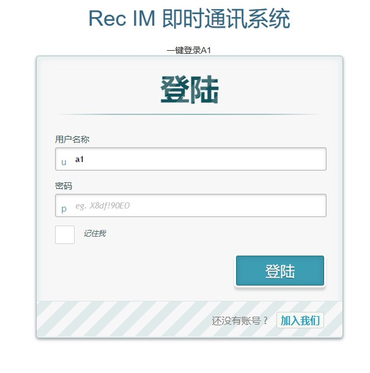
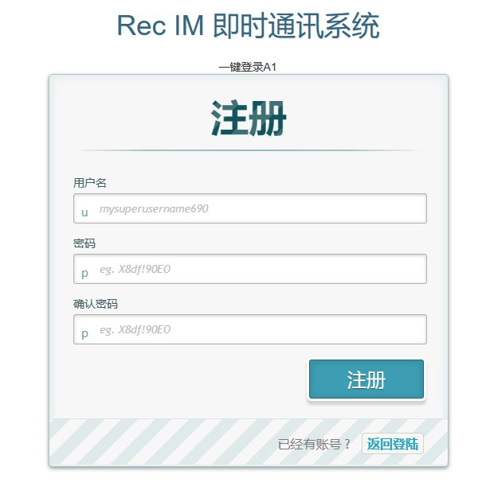
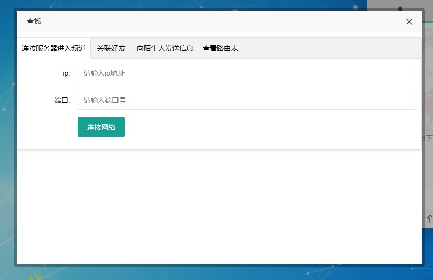
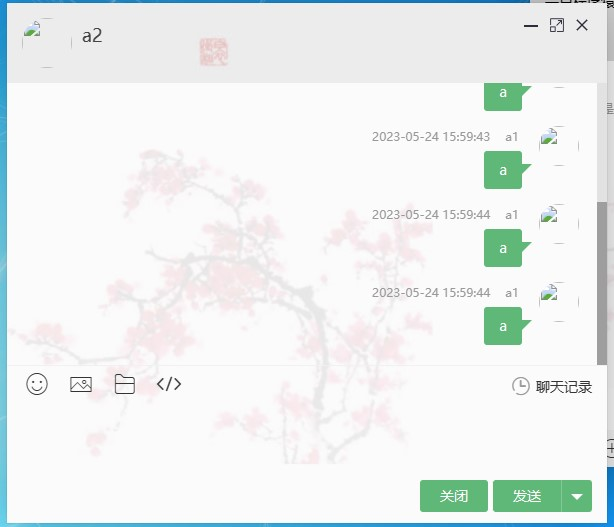

# 0x01 项目名称和简介
+ 中继加密通讯网络(Relay encrypted communication network, 缩写 Rec)

+ REC 的设计主要借鉴了非对称加密和 Kademlia 算法的一些设计思想
    + 非对称加密，主要体现在通信内容通过双方非对称加密密钥加密，确保通信内容的安全。
    + 借鉴 Kademlia 算法，节点间使用传输通信协议 UDP 沟通，Kademlia 节点利用分布式散列表（DHT）存储节点信息。通过现有网络，建立一个基于应用层的虚拟网络。
    + 使用非对称加密的公钥进行哈希计算获得一个 160 位的哈希值作为 Kademlia 的节点值。再由节点值建立虚拟路由表建立匿名中继网络。

# 0x02 项目特点
+ 自治和去中心化：节点共同组成系统，无需任何中央协调。
+ 容错：即使节点不断加入、离开和失败，系统也应该是可靠的。
+ 可扩展性：即使有数千或数百万个节点，系统也可以有效地运行。任何一个节点只需要与系统中的少数其他节点协调

# 0x03 项目安装指南

+ git
  ```git
    git clone https://github.com/0x00stone/Rec.git
  ```
+ 下载项目文件
  + Code-Download Zip- 解压
+ Open with GitHub Desktop

# 0x04 项目功能及使用指南
1. 使用命令行进入文件目录
2. 使用命令
    ```
    java -jar .\Rec-0.0.1.jar
    ```
3. 使用
  + 命令行界面 下方直接使用
  + 网页界面 使用浏览器打开127.0.0.1:9001
    > 修改端口可在resources/application.properties 中修改

# 0x05 使用范例
+ 登录界面
  
+ 注册界面
  
+ 主界面
  
+ 功能界面
  
+ 聊天记录界面
  
+ 聊天界面
  

